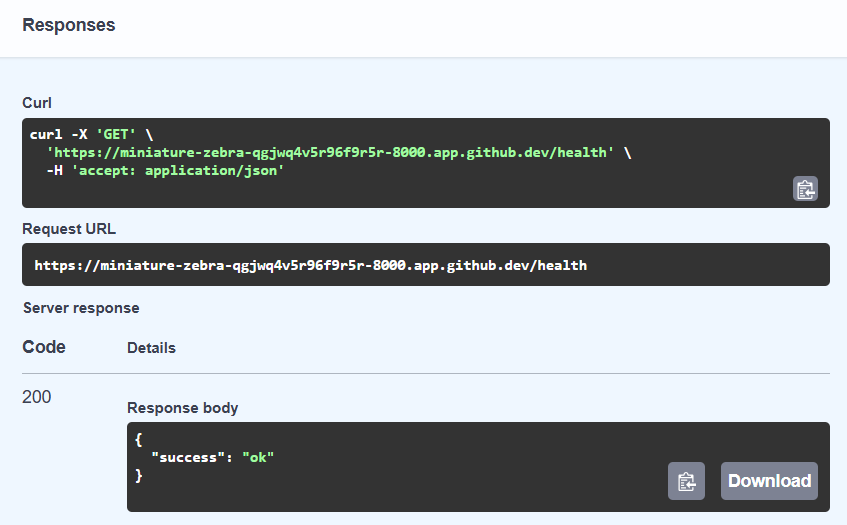
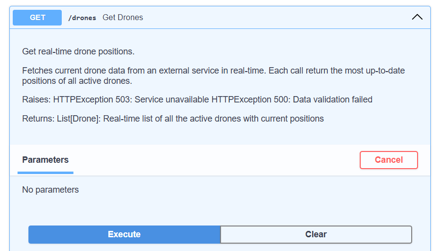
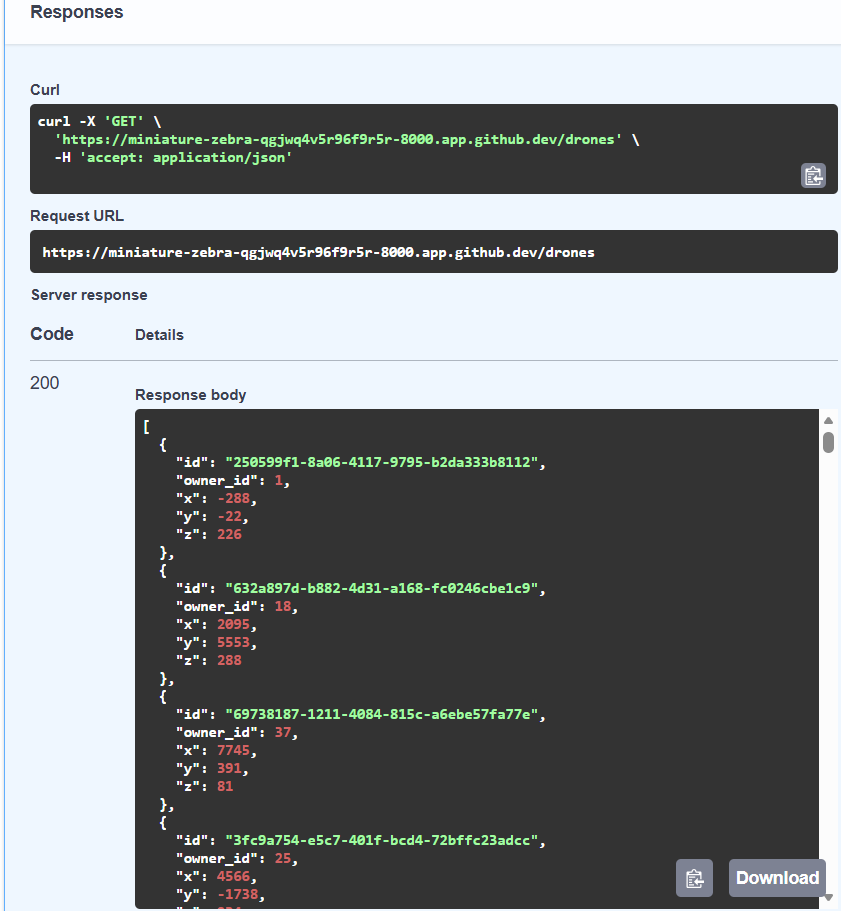
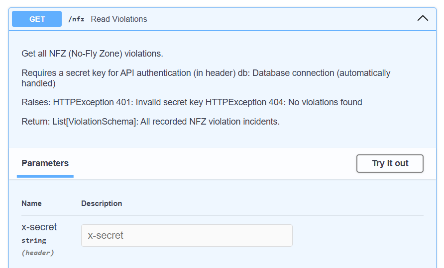
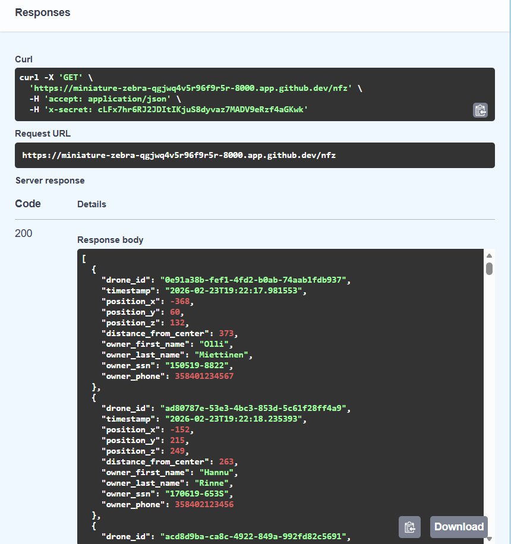

# AirGuardian Backend - Mini Version

A real-time drone monitoring system designed to protect critical infrastructure by detecting unauthorized drone incursions into a designated No-Fly Zone (NFZ). This FastAPI-based backend service periodically fetches drone position data, checks for violations, stores them in a database, and exposes API endpoints for data retrieval.

## Features

- **Real-time Monitoring:** Fetches drone positions data every 10 seconds using external API.
- **NFZ Violation Detection:** Detects drones that enter the 1,000-unit radius No-Fly Zone centered at `[0, 0]`.
- **Violation Storage:** Stores violations in PostgreSQL with owner details.
- **Security:** Protects sensitive violation data with a secret header authentication mechanism.
- **Fully Containerized**: Docker Compose spins up all services (FastAPI, Celery, PostgreSQL, Redis) in one command.
- **Test Automation:** Comprehensive test suite with pytest.
- **CI/CD**: GitHub Actions runs the pytest suite on every push/PR to `main`.


## API Endpoints

| Method | Path | Auth | Description |
|---|---|---|---|
| `GET` | `/health` | None | Service health check |
| `GET` | `/drones` | None | Live drone positions |
| `GET` | `/nfz` | `X-Secret` header | All recorded NFZ violations |


## Tech Stack

-   **Framework:** FastAPI
-   **Background Tasks:** Celery + Celery Beat
-   **Message Broker**: Redis 7
-   **Database:** PostgreSQL 16
-   **ORM:** SQLAlchemy 2.0 (async + sync) 
-   **Containerization:** Docker & Docker Compose
-   **Python Dependency Management:** Poetry
-   **Testing:** Pytest, pytest-mock, pytest-asyncio


## Project Structure

```
.
├── src/
│   └── fast_api_airguardian/
│       ├── main.py          # FastAPI app & route handlers
│       ├── task.py          # Celery tasks & NFZ detection logic
│       ├── celery.py        # Celery app configuration
│       ├── database.py      # Async/sync SQLAlchemy setup
│       ├── model.py         # SQLAlchemy models
│       ├── schemas.py       # Pydantic schemas
│       └── settings.py      # App settings via pydantic-settings
├── tests/
├── docker-compose.yml
├── Dockerfile
├── pyproject.toml
└── .env.example

```

## Demo

All endpoints are documented and testable via the interactive Swagger UI at `/docs`.

### `GET /health`


### `GET /drones` — Live drone positions



### `GET /nfz` — NFZ violations (requires `x-secret` header)
Each violation record includes the drone ID, timestamp, position coordinates, distance from center, and owner details (name, SSN, phone).





## How It Works

1. The **Celery beat** scheduler triggers `fetch_drone_positions_task` every 10 seconds.
2. The task fetches drone positions from the external API and checks each drone's distance from `[0, 0]`.
3. Any drone within the 1,000-unit radius is flagged as a violation; owner details are fetched and the record is stored in PostgreSQL.
4. The **FastAPI** service exposes the stored violations via the `/nfz` endpoint, secured with a secret header.


## 📋 Prerequisites

Ensure you have the following installed on your system:
-   Docker
-   Docker Compose
## ⚙️ Quick Start

1. **Clone & setup:**

   ```bash
   git clone https://github.com/imhaqer/fast-api-airguardian.git
   cd fast-api-airguardian


LOADING.. ⏳


